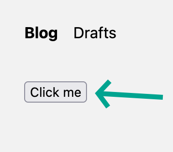

## Welcome

This repo was created with `npx try-prisma@latest --template typescript/rest-nextjs-api-routes` to provide a reproduction
of an issue related to `prisma` and nested relation `create` and `connect` in same batch.

## Getting Started

1. Run commands

```bash
npm i
npm run dev
```

2. Open /test


3. _Optional:_ Open the network tab
4. Click the button



5. Check the server logs, expected output:

```
thread 'tokio-runtime-worker' panicked at query-engine/core/src/interpreter/interpreter_impl.rs:71:26:

Expected record selection to contain required model ID fields.: FieldNotFound { name: "id", container_type: "field", container_name: "Record values: Record { values: [String(\"wqm5z06cof3kbbf4lrzk3zo9\"), String(\"clvgbsgq8000370227o22tfrq\")], parent_id: None }. Field names: [\"thingAId\", \"childUtilityId\"]." }

note: run with `RUST_BACKTRACE=1` environment variable to display a backtrace

PrismaClientRustPanicError:
    Invalid `prisma.thingA.create()` invocation:
```

Error details formatted for readability:

```json
{
    "name": "id",
    "container_type": "field",
    "container_name":
        // Record values: Record
        {
            "values": ["wqm5z06cof3kbbf4lrzk3zo9", "clvgbsgq8000370227o22tfrq"],
            "parent_id": "None",
            "Field names": ["thingAId", "childUtilityId"]
        }
}
```

## Schema Explanation

[schema.prisma](prisma/schema.prisma)

The schema is a bit complicated but it's structure cannot easily be changed, in our actual project the need for the
`LinkToChildUtility` is a bit more obvious as there are more types of children types available and the linking utility
serves a clearer purpose.

In effect the schema is supporting an object of the type `ThingA`, which can look something like:

```typescript
type A = {
    parts: {
        childUtility: {
            childA?: {
                // At this part we could recursively select further but our use case doesn't require it
                id: string;
            };
            childB?: {
                // In our project we don't even select "this far down", we'd just select the ID,
                // but I'm including this so you can see the effective shape of ThingB
                childUtility: {
                    childA?: {
                        id: string;
                    } & Partial<A>;
                    childB?: {
                        id: string;
                    };
                };
            };
        };
    }[];
};
```

## Code (with links to the files in the repo, not hosted urls)

-   Frontend Page: [http://localhost:3000/test](src/app/test/page.tsx)
-   Backend Route: [/api/test](src/pages/api/test.ts)
    -   This is the code exhibiting the problem, it's being brought about by the "recursion" probably

The problem is occurring when we're trying to create everything required for the following payload in a single request to
`prisma.thingA.create`

```typescript
const idOfNewNestedA = "the-thing-to-be-connected";
const newThingA: A = {
    parts: [
        {
            childUtility: {
                childA: { id: idOfNewNestedA },
            },
        },
        {
            childUtility: {
                childB: {
                    childUtility: {
                        childA: {
                            parts: [
                                {
                                    childUtility: {
                                        childB: { childUtility: { childA: { id: idOfNewNestedA } } },
                                    },
                                },
                            ],
                        },
                    },
                },
            },
        },
    ],
};
```
